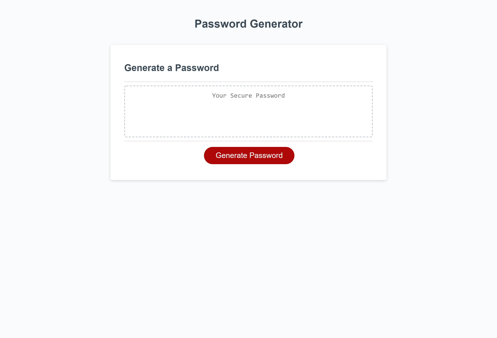

# Password Generator

This app is designed to create a unique password for the user.
The user will need to:

- Choose a password length between 8 and 128 characters long.
- Specifiy if they speacial characters
- Specifiy if they lowercase characters
- Specifiy if they uppercase characters
- Specifiy if they numerical characters
  _The app will defualt to an all lowercase password if no character selections are made_

https://hp-adam.github.io/password-generator/
